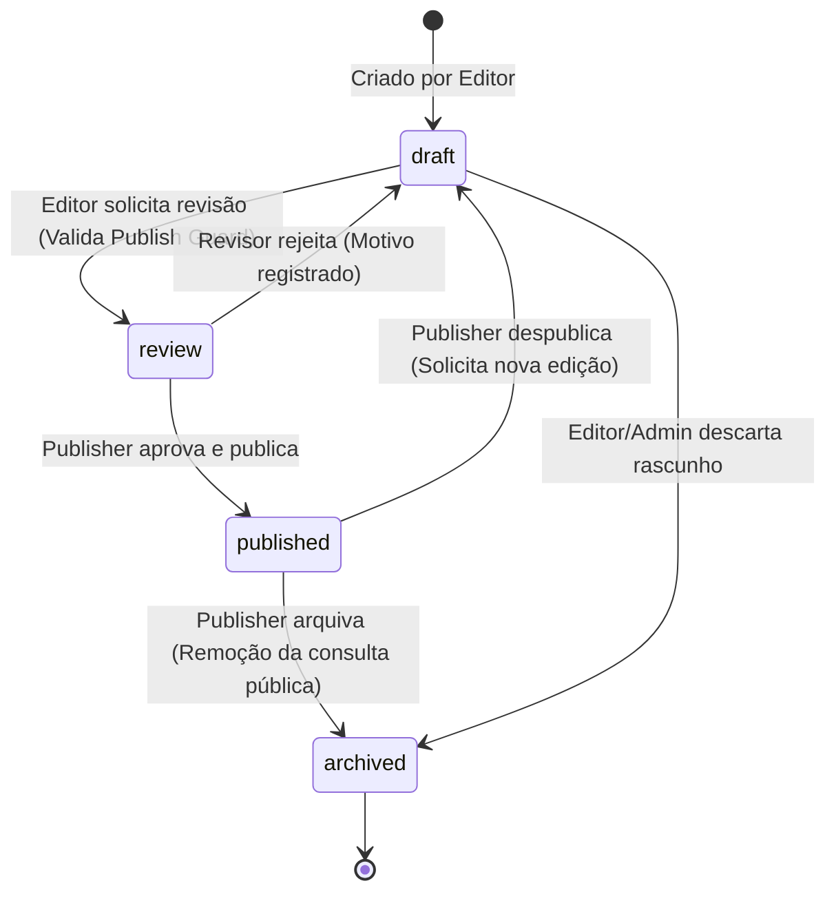

# ADR 0006: Operação Editorial, RBAC e Publicação

- **Status:** aceito
- **Data:** 12/08/2026
- **Autores:** Codex / Antigravity (IA assistida)
- **Decisor:** Proprietário do Produto (Owner)
- **Task relacionada:** ECO-1303

---

## 1. Contexto e Problema

O aplicativo ECOnexão exibe regiões, rotas eco-turísticas, origens e atores locais (produtores, hospedagens, serviços). Para garantir a integridade do conteúdo público e prevenir dados incompletos ou não homologados (evitando alegações ecológicas falsas ou *greenwashing*), é necessária uma política de governança editorial estrita.

Atualmente, o Supabase Auth concede a qualquer usuário autenticado o papel genérico de sessão `authenticated`, o que **não é suficiente** para autorização administrativa ou controle editorial.

É preciso definir:
1. Os **papéis editoriais (RBAC)** e suas responsabilidades.
2. A **máquina de estados (state machine)** de publicação de conteúdo.
3. As **regras de Publish Guard** (prevenção de publicação incompleta).
4. O modelo de **Auditoria (Audit Trail)** append-only.
5. As regras de **Segregação de Funções** (*Separation of Duties*).

---

## 2. Definidor de Papéis Editoriais (RBAC) e Capabilities

Seguindo o princípio de menor privilégio (*least privilege*), o controle de acesso editorial será mantido em schema privado (`app_private.memberships`) no banco de dados e validado estritamente pela API FastAPI (nunca dependendo apenas da UI frontend).

| Papel | Descrição / Atribuição | Capabilities Concedidas |
|---|---|---|
| **`admin`** | Administrador da plataforma e gestão de acessos | Criar/revogar convites e memberships editoriais; gerenciar categorias; visualizar audit trail completo; ações de emergência (*break-glass*). |
| **`editor`** | Criador e mantenedor de conteúdo territorial | Criar e editar rascunhos (*drafts*) de regiões, rotas, origens, atores e mídias; associar geometrias; submeter para revisão. **Não pode publicar diretamente.** |
| **`reviewer`** | Revisor de qualidade, acessibilidade e factualidade | Revisar itens em `review`; aprovar ou rejeitar rascunhos solicitando ajustes com justificativa registrada. **Não pode criar rascunhos nem alterar dados diretamente.** |
| **`publisher`** | Editor sênior com autoridade legal/editorial de publicação | Executar a transição `published` de itens em `review` aprovados; despublicar (*unpublish*) ou arquivar conteúdo. |

---

## 3. Máquina de Estados (State Machine) de Conteúdo

Todo recurso editorial (`region`, `route`, `origin`, `actor`, `media`) obedece aos seguintes estados e transições estritas:

### Transições Válidas e Autorização:
- `draft` → `review`: Executado por `editor` (Dispara validação do **Publish Guard**).
- `review` → `draft`: Executado por `reviewer` ou `publisher` (Exige motivo de rejeição).
- `review` → `published`: Executado por `publisher`.
- `published` → `draft`: Executado por `publisher` (Despublicação lógica).
- `*` → `archived`: Executado por `publisher` ou `admin`.

---

## 4. Regras do Publish Guard (Garantia de Completude)

Um recurso em estado `draft` **não pode transicionar para `review` ou `published`** se violar qualquer um dos critérios de completude abaixo:

1. **Regiões & Rotas:**
   - Devem possuir geometria validada em PostGIS (`SRID 4326`), dentro dos limites aceitáveis.
   - Devem ter ao menos 1 origem associada.
   - Texto descritivo e imagem de capa com `alt_text` e licença válida.
2. **Atores:**
   - Devem possuir coordenadas de localização válidas.
   - Pelo menos uma categoria válida atribuída.
   - Vínculo com ao menos 1 rota ativa.
   - Contato verificado (telefone, WhatsApp ou e-mail formatado).
3. **Mídias:**
   - Status de processamento de imagem em `ready` (EXIF removido, derivados gerados).
   - Atribuição de crédito e termos de licença preenchidos.

Se qualquer item falhar, a API FastAPI retorna `HTTP 422 Unprocessable Entity` com a lista detalhada de lacunas.

---

## 5. Auditoria Append-Only (Audit Trail)

Todas as ações administrativas e editoriais geram um registro imutável na tabela `app_private.audit_logs`:
- `id`: UUID único.
- `timestamp`: UTC automático.
- `actor_id`: UUID do usuário autenticado (`auth.uid()`).
- `action`: Ação executada (`CREATE`, `UPDATE`, `TRANSITION_STATUS`, `DELETE`, `RECONCILE`).
- `resource_type` & `resource_id`: Identificação do registro.
- `changes`: Payload JSON com `before` e `after`.
- `reason`: Justificativa obrigatória para rejeições, despublicações e reconciliações.

*Nota: Esta tabela possui RLS que proíbe comandos `UPDATE` e `DELETE`, garantindo que o histórico seja inalterável.*

---

## 6. Segregação de Funções (Separation of Duties)

Para prevenir auto-aprovação de conteúdo:
- Um `editor` **não pode aprovar ou publicar o próprio rascunho**, mesmo que também possua o papel de `publisher` em outro contexto (aplicado via check de identidade `actor_id != author_id` na transição de status).

---

## 7. Decisão para Aprovação do Owner

Decisão formal registrada pelo proprietário:

- [x] **Aprovado na íntegra:** Papéis (`admin`, `editor`, `reviewer`, `publisher`), máquina de estados (`draft` → `review` → `published` / `archived`), Publish Guard e audit trail inalterável conforme detalhado.
- [ ] **Aprovar com modificações:** (Nenhuma modificação solicitada).

---

## 8. Consequências da Decisão

- Guiará a criação da migration de RBAC e Audit Trail na task **ECO-1403**.
- Orientará o contrato da API administrativa na task **ECO-1601**.
- Determinará o fluxo da tela de revisão no painel administrativo na task **ECO-1804**.
